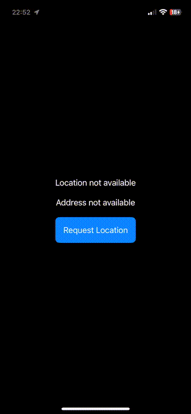

# CoreLocation-SampleApp

This repository contains a sample iOS application built in **Xcode** and migrated to **Swift 6.0**. The app demonstrates the use of **Core Location Services** to provide location-based features. It serves as an example project for developers looking to understand or implement Core Location functionality in their iOS applications.

## 🎥 Demo Video

Check out the app in action!  
  


## 🚀 Features

- **Real-time Location Updates**: Fetch and display the user’s current location.
- **Geocoding and Reverse Geocoding**: Convert addresses to coordinates and vice versa.
- **Permission Handling**: Manage location permissions effectively.

## Requirements

- **Xcode 15.0 or later**
- **iOS 16.0 or later**
- **Swift 6.0**

## Getting Started

1. Make sure you have Xcode installed.
2. Clone this repository:
   ```bash
   git clone https://github.com/JaCaLla/LocationSampleApp.git

